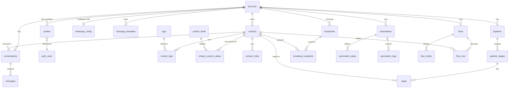

# DATABASE REFERENCE

---

## Entity Relationship Diagram (High Level)

---

## Core Tables

### accounts
-   **Purpose**: Root tenant entity for multi-user collaboration.
-   **Fields**:
    -   `id` (UUID, PK): Unique identifier.
    -   `name` (TEXT): Display name for the account.
    -   `owner_user_id` (UUID): Reference to `auth.users` who created/owns the account.
-   **Constraints**: `idx_accounts_one_per_owner` (One account per user).

### profiles
-   **Purpose**: User details and account membership status.
-   **Fields**:
    -   `id` (UUID, PK): Unique identifier.
    -   `user_id` (UUID): Reference to `auth.users`.
    -   `account_id` (UUID): Reference to `accounts`.
    -   `account_role` (account_role_enum): `owner`, `admin`, `agent`, or `viewer`.
    -   `full_name`, `email`, `avatar_url` (TEXT).
    -   `beta_features` (TEXT[]): List of enabled beta flags.

### contacts
-   **Purpose**: Lead and customer database.
-   **Fields**:
    -   `id` (UUID, PK): Unique identifier.
    -   `account_id` (UUID): Tenant isolation key.
    -   `phone` (TEXT): WhatsApp-compatible phone number.
    -   `name`, `email`, `company`, `avatar_url` (TEXT).

### conversations
-   **Purpose**: Grouping messages by contact and account.
-   **Fields**:
    -   `id` (UUID, PK): Unique identifier.
    -   `account_id` (UUID): Tenant isolation key.
    -   `contact_id` (UUID): Reference to `contacts`.
    -   `status` (TEXT): `open`, `pending`, `closed`.
    -   `last_message_text` (TEXT), `last_message_at` (TIMESTAMPTZ).
    -   `unread_count` (INTEGER).

### messages
-   **Purpose**: Individual message logs (inbound and outbound).
-   **Fields**:
    -   `id` (UUID, PK): Unique identifier.
    -   `conversation_id` (UUID): Reference to `conversations`.
    -   `sender_type` (TEXT): `customer`, `agent`, `bot`.
    -   `content_type` (TEXT): `text`, `image`, `document`, `audio`, `video`, `location`, `template`, `interactive`.
    -   `content_text` (TEXT), `media_url` (TEXT).
    -   `status` (TEXT): `sending`, `sent`, `delivered`, `read`, `failed`.
    -   `message_id` (TEXT): Meta's internal message ID for tracking.
    -   `interactive_reply_id` (TEXT): ID of the button/list item tapped.

### whatsapp_config
-   **Purpose**: Credentials for Meta WhatsApp Business API.
-   **Fields**:
    -   `id` (UUID, PK): Unique identifier.
    -   `account_id` (UUID): Reference to `accounts` (One per account).
    -   `phone_number_id` (TEXT): Meta's ID for the phone number.
    -   `waba_id` (TEXT): Meta's ID for the WABA.
    -   `access_token` (TEXT): AES-encrypted Meta access token.
    -   `verify_token` (TEXT): AES-encrypted webhook verification token.
    -   `status` (TEXT): `connected`, `disconnected`.

---

## Automation & Flow Tables

### automations
-   **Purpose**: No-code workflow definitions.
-   **Fields**:
    -   `id` (UUID, PK): Unique identifier.
    -   `account_id` (UUID): Tenant isolation key.
    -   `name`, `description` (TEXT).
    -   `trigger_type` (TEXT): e.g., `keyword_match`, `tag_added`.
    -   `is_active` (BOOLEAN).

### automation_steps
-   **Purpose**: Individual actions within an automation.
-   **Fields**:
    -   `id`, `automation_id` (UUID).
    -   `step_type` (TEXT): `send_text`, `wait`, `condition`, etc.
    -   `step_config` (JSONB): Configuration for the step.
    -   `position` (INTEGER): Order in the sequence.

### flows
-   **Purpose**: State-aware conversation flow definitions.
-   **Fields**:
    -   `id`, `account_id` (UUID).
    -   `name`, `status` (TEXT).
    -   `trigger_type` (TEXT): `keyword`, `manual`, etc.
    -   `entry_node_id` (TEXT): Starting node key.

### flow_nodes
-   **Purpose**: Individual nodes in a conversation flow graph.
-   **Fields**:
    -   `id`, `flow_id` (UUID).
    -   `node_key` (TEXT): Human-readable stable identifier (e.g., "menu").
    -   `node_type` (TEXT): `send_buttons`, `collect_input`, etc.
    -   `config` (JSONB): Node configuration and edge targets.

### flow_runs
-   **Purpose**: Active execution state for a contact in a flow.
-   **Fields**:
    -   `id`, `flow_id`, `contact_id` (UUID).
    -   `status` (TEXT): `active`, `completed`, `failed`.
    -   `current_node_key` (TEXT).
    -   `vars` (JSONB): Accumulated data from customer inputs.

---

## RLS & Security Policies

### is_account_member(target_account_id, min_role)
-   **Type**: PostgreSQL SECURITY DEFINER Function.
-   **Logic**: Returns `true` if `auth.uid()` has a role >= `min_role` in `target_account_id`.
-   **Role Hierarchy**: `owner` (4) > `admin` (3) > `agent` (2) > `viewer` (1).

### Global Policy Pattern
-   **SELECT**: `USING (is_account_member(account_id, 'viewer'))`
-   **INSERT/UPDATE/DELETE**: `USING (is_account_member(account_id, 'agent'))` (Operational data like messages/contacts) or `'admin'` (Settings data like templates/config).

---

## Realtime Publications
-   `messages`: Broadcasts on every new message for real-time inbox updates.
-   `conversations`: Broadcasts on status changes or last-message updates.
